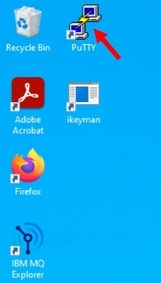
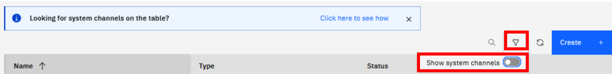
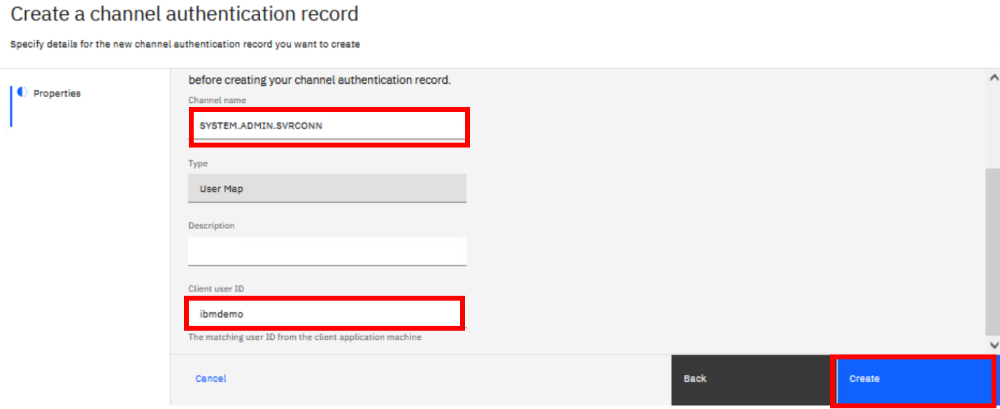
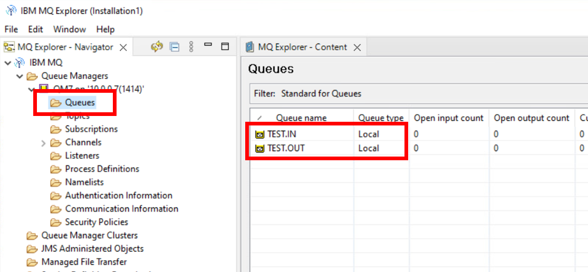

# Lab 1 - Getting started with the MQ Appliance

In this lab, you will configure the appliance and test that the
basic configuration is working as expected.

VMs required:

* **Windows**
* **MQAppl7**

This lab simulates the initial configuration of a physical MQ Appliance. When you are setting up a new MQ Appliance for the first time, you must connect a serial cable to the appliance through the Serial "Console Connector." When shipped, this is the ONLY port that is available to use, all others are unconfigured. So this process configures the network adapters, as well as optionally (which you do in this lab) remote access via SSH and the MQ web console.


## Open the virtual appliance (MQAppl7)


1.  Click the **XXXXXXX_WM605G_XX_MQAAPL7** VM. 

	
	
2.  Wait for the virtual machine to power on.

    
    
1.  Return to the original tab and open the **XXXXXXX_WM605G_XX_WINDOWS** machine. 
	
1.  You now have three browser tabs open, Windows in one, the current appliance console for MQAppl7, and one to return to the environment.

	

## Basic appliance configuration 


1.  Enter **admin** as the **login** user name.

4.  Enter **admin** as the initial **password**.

	

5.  Enter **Passw0rd!** (note the "0") next to "**Please enter new password**".

6.  Enter **Passw0rd!** (note the "0") next to "**Please re-enter new password to confirm**".
    

    > <span style="color: red">**WARNING:** <br>You may use any password you like. However, please be sure to remember whatever you use. If you forget your password on a real appliance, you may have to return the appliance to IBM to be reset.</span><br>


    

7.  Enter **y** next to "**Do you want to run the Install Wizard?**"

    > <span style="color: Blue">**Note:** <br>You will need to press enter after typing each entry. Or you may just hit enter to accept the default for the entry.</span><br>

    

8.  Enter **y** next to "**Step 1** -- **Do you want to configure network interfaces?**"

    
    
9.  Enter **y** next to "**Do you have this information?**"

10. Enter **y** next to "**Do you want to configure the eth0 interface?**"

11. Enter **n** next to "**Do you want to enable DHCP?**"

	

	**Note** Please be careful to follow the IP configuration exactly. If you have any concerns please as an instructor. 

14. Enter **10.0.0.17/24** as the IP address.

15. Enter **10.0.0.1** as the default gateway address.

	

16. Enter **y** to the question **- "Do you want to
    configure the eth1 interface?"**

17. Enter **n** to the question **- "Do you want to
    enable DHCP?"**

14. Enter **10.0.1.17/24** as the IP address.

15. Enter **10.0.1.1** as the default gateway address.

	
	
16. Enter **y** to the question **- "Do you want to
    configure the eth2 interface?"**

17. Enter **n** to the question **- "Do you want to
    enable DHCP?"**

18. Enter **10.0.2.17/24** as the IP address.

19. Enter **10.0.2.1** as the default gateway address.

20. Similarly configure **eth3** and **eth4** with address
    **10.0.3.17/24** with gateway **10.0.3.1** and address
    **10.0.4.17/24** with gateway **10.0.4.1** as shown in the below screen shot.

	

21. Enter **y** next to **"Do you want to configure
    network services?"**

22. Enter **n** next to **"Do you want to configure
    DNS?"**

23. Enter **y** next to **Step 3 -- Do you want to assign a unique identifier for the appliance?"**

24. Enter a unique identifier for the appliance: **MQAppl7**.

	

    > <span style="color: Blue">**NOTE:** <br> A unique system identifier is required when using high availability, to uniquely identify each appliance within the high availability group. </span>
  
  
25. Enter **y** next to **"Do you want to configure remote management access?"**

26. Enter **y** next to **"Do you have this information?"**

27. Enter **y** next to **"Do you want to enable SSH?"**

28. Enter **0** next to **Enter the local IP address**

29. Press the **Enter** key to **accept the default port (22).**

	
	

30. Enter **y** next to **"Do you want to enable WebGUI access"**.

31. Enter **0** next to **"Enter the local IP address"**

32. Press the Enter key to **accept the default port (9090) for WebGUI access**.

	
	
33. Enter **y** next to **Step 5 --** **Do you want to configure a user account that can reset passwords?"**

34. Enter a unique user name for the user account (make sure you make a note of whatever you choose), for example: **mqadmin**

35. Enter a password next to **"Enter new password"**, for example: **Passw0rd!**

36. Enter the same password next to **"Re-enter new password"**

	

37. Enter **y** next to **"Do you want to review the current
    configuration?"**

38. Enter **y** next to **"Do you want to save the current
    configuration?"**

39. Enter **y** next to **"Overwrite previously saved configuration?"**

	
	
	> <span style="color: Blue">**NOTE:** <br> If you are performing the configuration on the HTML5 client console, you will notice there are no scroll bars. However, you can use the **shift+PgUp** keyboard combination to scroll up and **shift+PgDn** to scroll down. This should allow you to see the entire configuration.

	The last step is to display the IP addresses of the adapters. This will be required later when you try to access the queue managers you create in the appliance.

40. Execute **show ipaddress**.

	

	**Ensure that the IP addresses match those shown in the screenshot above. They will be used to access the appliance.**

	The next step is to accept the license agreement. This must be done with the WebGUI. 

41. Go to the Windows VM in your environment.

42. You should already be logged on. If not, log on to Windows with the user name **admin** and password **IBMDem0s**

43. Start FireFox web browser session.

44. Navigate to **https://\<address of eth0\>:9090** (or use the
    shortcut that is there for you). If you receive any warnings, allow the exception and continue.

	

1.  If you receive any security exceptions, click *Advanced*, then *Accept the Risk and Continue*. 

	
	

45. You will now see the console log in screen.

46. Enter **admin** as the User name.

47. Enter **Passw0rd!** (or whatever you chose earlier) as the Password.

48. Click **Login**.

	
	
49. Click **I agree** to accept the license agreement.

	

50. The appliance will now process the license acceptance. All logged in users will now be disconnected.

	

51. After waiting a couple of minutes, click on the MQAppl7 bookmark to reload the page. 

52. Log in with the **admin** user name, and password **Passw0rd!**.

	

	> <span style="color: Blue">**NOTE:** <br> Sometimes when you log back in you will be presented with the license page again, if this happens then wait a little longer and try clicking on the bookmark again.

54. You are now logged on to the console.

	
	
After the setup of the MQApp7 in Lab 1 and for all other labs, you should use *PuTTY* to SSH to the appliances when you want to use the appliance CLI. With *PuTTY*, you can easily scroll and copy/paste.

## Create and configure a queue manager
 
The next part of the lab will create and configure a queue manager. This
will be done using the command line interface provided by the appliance
console. This could also be done using a secure shell connection, using
the port that was configured earlier (port 22 is the default), or via the web console.

The MQ appliance has the concept of modes. When the administrator logs
in as admin, the shell will initially be an administrative shell. MQ
commands are not part of the administration mode. The **mqcli** command
can be used to change to MQ administration mode. Once in MQ
administration mode, the normal administration commands are not
available. To exit from MQ administration mode, use the **exit** command.

1. Open a *PuTTY* session by double-clicking the icon on the Windows desktop.

	
	
1. In the *PuTTY* window, enter the IP address for *MQAppl7* **10.0.0.17** and click *Open*. 

	
	
1. Click *Yes* to the security alert.

	

2. You will need to log on again as **admin**.

3. Enter **Passw0rd!** (or whatever was selected earlier) as the
    **Password**.

	The help command will display all valid commands for the current mode.

4. Execute the **help** command.

	

5. Details on a particular command can be displayed by adding the command to the help command.

6. Execute the **help clock** command.

	

7. Use the **clock** command to set the date and time (note as shown
    below that the date format is yyyy-mm-dd and the time uses the 24h clock).

	

	In order to create a queue manager, the command line interface must be in MQ mode.

8. Execute the **mqcli** command. 

	You will now see the MQ command line interface prompt (**mqcli**).

	You can use the **help** command to display a list of available commands.

9. Execute the **help** command.

	

	To see the actual MQ commands that are available use the **help mq** command.

10. Execute the **help mq** command.

	

	If you are unfamiliar with MQ command formats, the syntax for a particular MQ command can also be displayed using the help command.

11. You will create a queue manager, so review the syntax required for that.
    
    Execute the **help crtmqm** command.

	
	
    > <span style="color: Blue">**Note:** <BR> Remember that MQ is case sensitive.</span>

	You will now create a queue manager named **QM7** using the
    **crtmqm** command. The listener port will be 1414. The default file
    system size is set to 64GB on a real appliance, but you need to set
    it to only 2GB (using the **-fs** flag) on the virtual appliance.

12. Execute the following command:

	```
	crtmqm -p 1414 -u SYSTEM.DEAD.LETTER.QUEUE -fs 2 QM7
	```

	

13. Execute the **strmqm QM7** command to start the queue manager.

	```
	strmqm QM7
	```

	

	You can see that the queue manager is started and is at MQ v9.4.1.0.
    The status of the queue managers can be displayed with the **dspmq** command.

14. Execute the **dspmq** command.

	

	The queue manager must now be configured to allow connections,
    **including from MQ Explorer**. This will be done in the next
    section of this lab.

## Configuring the queue manager for connections

When a queue manager is first created, no external connections are
allowed. The queue manager must now be configured to allow connections,
including connections from MQ Explorer.

1. First, we will create a messaging user. Execute the following
    command:

    ```
    usercreate -u ibmdemo -g mqm -p Passw0rd!
    ```

	

	It is worth mentioning here that this user is different than the
    users that you have worked with previously. The other users are
    administrative users for the appliance; this is a messaging (MQ)
    user.

	We now need to set up a SVRCONN channel for administration from MQ
    Explorer, but we must also setup the appropriate channel
    authentication and connection authorization to allow access to the
    channel and queue manager. This could also be performed from the
    command line. However, given that the commands are quite long to
    enter, we will use the web console to do this.

2. Swap back to the web console and log in again if you are not already logged in. Scroll down so you can see the whole window. Notice that the *Manage* tile shows that one queue manger is running (QM7). Click the **Manage** tile. We will use this one for administering QM7.
    
    

4. The *Manage* tab shows a list of queue managers defined on this appliance. You defined and started **QM7** on the appliance's command line. You can see that it is running. 
    
    

5. Click the **QM7** hyperlink. The details of the queue manager are now displayed and here you can manage the queue manager. 

	In this window you can select MQ objects to manage. This default opens to *Overview*. You can also navigate to *Queues*, *Event*, *Applications*, or *MQ Network*. Click **Applications**. 

	

1. In the Application tab, you can view the connected application and create *App channels*, better known as server connection channels. Click **App channels**. 

	

1. You have not created any channels yet, so none are shown. However, there are *SYSTEM.\** channels. Click the **Filter** icon (looks like a funnel), which will allow you to *Show system channels*. Click the button in that popup to show those channels (if you click the *Filter* again, it toggles the display off).

	
	
1. The *System.\** channels are now visible. You now need to create a SVRCONN channel for MQ Explorer. Click **Create**.

	
	
1. A definition of *server connection channel* is provided. Click **Next**. Enter the name for your server connection channel - **SYSTEM.ADMIN.SVRCONN**. Click **Create**.

	
	
	A green success message is displayed and the new channel appears in the list. 
	
	 
	
	You now need to create the channel authentication record for this channel. Click **View configuration** in the top right corner. This will take you to the queue manager properties.
	
1. The queue manager configuration is divided into five sections - *Properties*, *Security*, *Listeners*, *High availability*, and *Disaster recovery*. Click **Security**.

	 
	 
1. Objects in the Security section are *Authentication information*, *Authority records*,  *Channel authentication*, and *File system encryption*. Click **Channel authentication** to create a new record.

	
	
1. The default records are displayed. Click **Create**. 

	 	 
1. You will create a new channel authentication record that allows access to the new channel for your *testuser* that you created. Click on the **Allow** tile for the *Rule type*, and **Client application user ID** for the *Identifier*. Click **Next**.

	 
	
	
1. Enter the channel name **SYSTEM.ADMIN.SVRCONN** in the *Channel name* field. Enter **ibmdemo** in the *Client user ID* field. Notice that the rule type is auto-filled to *User Map*. Click **Create**. 

	 
	
1. A green Success message is displayed. Click the wrench icon if you want to view or edit the rule. 

	
	
1. You also need to set the authentication object to accept the credentials as presented by the application. Click **Authentication information**. 

	

1. Click the *wrench* for the **IDPW OS** object (that is, operating system userid and password checking). 
	

20. Select the **User ID + password** tab. The *Adoption context* is already set to **Yes**. There is nothing to change. But if a change was necessary, you could click *edit* and change the values.

	   
	
1. Click the *browser back button* to return to *Security*. Click the **Channel authentication** tab, then click the **Create** button to add another record. Click on the **Block** tile for the *Rule type*, and **Final assigned user ID** for the *Identifier*. Click **Next**.

	

1. Again enter **SYSTEM.ADMIN.SVRCONN** in the *Channel name* field. Enter **\*whatever** in the **User list** field then click the "**+**" sign to add the list. Once the list is added, you can click **Create**.

	

28. Once again you receive the green success message and all the rules are displayed.

	

1.	Last but not least, we need to refresh the queue manager security to pick up the changes in the CONNAUTH. Click the **Actions** drop down in the top right corner and select **Refresh connection authentication**. 

	
	
1. Click **Refresh** to confirm you want to update the connection authentication records.

	

36. Start **MQ Explorer** on the Windows image.

    

37. In the Navigator pane, right-click **Queue Managers**.

38. Select **Add Remote Queue Manager...**

	

39. Enter **QM7** as the Queue manager name. Click **Next**.

	

40. Enter the IP address of the *MQAppl7* appliance.

	
	
	Click **Next**.

42. It is not possible to use security exits on the appliance, so click
    **Next** again.

43. Select the check box next to **Enable user identification**.

44. Enter **ibmdemo** as the **Userid**.

45. Select the **Prompt for password** radio button. 

	Click **Finish.** 
	
	
	
46. In the *Password details* popup, enter the password ("Passw0rd!") and then click **OK**. 

	
	
49. The queue manager should now be visible in MQ Explorer.

	

50. If you look at the Properties Quickview pane (click on the **QM7 on '10.0.0.17(1414)'** entry in the Navigator to populate this pane), you will see that the
    MQ Explorer has identified that this is a queue manager running on an appliance.

	

	You will need a couple of local queues for testing, so you will use
    the runmqsc interface on the appliance console to explore it.

51. Go back to the appliance command line console. 

	You access runmqsc in much the same way as you are used to.

52. From the mqcli (command line interface), enter:

	```
	runmqsc QM7
	````

	

	> <span style="color: Blue">**NOTE:** <br> This command should show an output similar to the image. It may feel like it is loading since there will be no cursor but this command starts up quickly so you should be able to move onto the next step right away.

54. Create a new local queue named **TEST.IN**

	```
	define ql(TEST.IN) defpsist(YES)
	```
	> <span style="color: Blue">**NOTE:** <br> The `ql` in this command is a Q and an L in lowercase. Sadly this font uses the same symbol for an uppercase i and for the number 1 so sometimes it is unclear.
 > 
38. Create another queue named **TEST.OUT**

	

56. Type **end** to exit from runmqsc

57. Go back to MQ Explorer; both of these queues should be visible in
    MQ Explorer (drill down to the **Queues** folder in the Navigator).

	

## Running applications against the appliance

The appliance has now been configured for administrative access with MQ
Explorer and two queues have been created. The next part of the lab will
run MQ applications against the appliance. The appliance must be
configured to allow connections. A SVRCONN channel (USER.SVRCONN) will
be created and configured to allow client access. The user (ibmdemo)
that was created in the previous exercise will be used.

1. Return to the web console.

2. Click the **QM7** breadcrumb in the top left to return the Manage page for QM7. As before, create a SVRCONN channel named **USER.SVRCONN**; click **Applications** > **App channels** > **Create** > **Next**. 

	

1. As before, create a channel authentication record to allow the ibmdemo user access to the channel; click **View Configuration** > **Security** > **Channel authentication** > **Create**. Then **Block** > **Final assigned user ID** > **USER.SVRCONN** > \***whatever**.
    
    The command would be:

	```
       SET CHLAUTH('USER.SVRCONN') TYPE(BLOCKUSER) USERLIST('\*whatever')
	```

	
	
	And refresh security: click **Actions** > **Refresh connection authentication** > **Refresh**.
	
	You will now use RFHUtilc to test the configuration.

5. Open rfhutilc from the desktop.

   

8. Set the **Queue manager** to **USER.SVRCONN/TCP/10.0.0.17(1414)**

9. Click **Set Conn Id**.

	

10. Enter the Userid as **ibmdemo**.

11. Enter the Password as **Passw0rd!**.

13. Click **OK**.

	

	The next step will load the drop-down box with the queues that are
    defined on the queue manager. It will connect to the queue manager
    to get the queue names.
    
14. Click **Load Names**.

	
	
	If successful, you see nothing happen.

15. Use the drop-down menu to select **TEST.IN** as the **Queue Name**.

16. Click **Open File**.

    

17. Navigate to *Documents* folder . 

18. Select the **text1.txt** file.

19. Click **Open**.

    

20. Click **Write Q**. This command puts the message to the **TEST.IN**
    queue.

	

21. Return to **MQ Explorer**.

22. Select the **TEST.IN** queue.

23. Click the right mouse button.

24. Select **Browse Messages**.

	

	The message should be visible.

25. Click **Close**.

	


## Completed the lab

Congratulations! You have completed the lab successfully.

**NOTE** To simplify the future labs we have pre-completed the *Basic appliance configuration* on the other appliances. 
 
