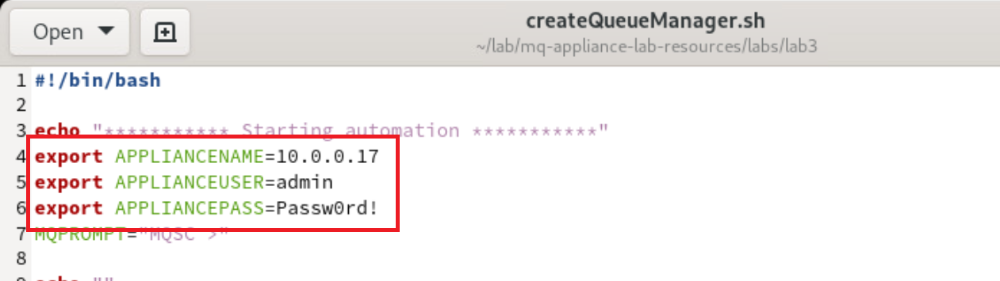

# Lab 2 - Scripting configuration for the MQ Appliance

## Overview 

In this lab, you will explore a common approach to scripting on the MQ Appliance. While various tools and technologies are available for scripting, the techniques demonstrated here are widely applicable across other options as well.

Virtual Machines Required:
* **Workstation**: A Red Hat Enterprise Linux (RHEL) workstation.
* **MQAppl7**: An instance of the MQ Appliance.

This lab assumes no prior configuration beyond the minimal network setup performed in Lab 1 for the MQAppl7 environment. The RHEL workstation is used instead of a Windows environment due to the reliance on Expect scripting, which is more readily available and commonly used in UNIX/Linux systems.

**Objectives**
By the end of this lab, you will:

* Gain familiarity with the MQ CLI client tool.
* Understand how to establish a connection between the tool and the MQ Appliance.
* Learn how to execute a single command.
* Explore scripting techniques for executing multiple commands.
* Discover how to run MQSC scripts effectively.

## What is the IBM MQ Appliance MQ CLI client?

The IBM MQ Appliance provides an SSH interface for executing commands from a remote system. However, to maintain the integrity of the appliance, the SSH interface that is provided does not support all the features of an standard SSH server. The current restrictions mean that it is necessary for scripts to simulate an interactive user session with the appliance, which is commonly achieved by using *expect*.

This MQ CLI client can be used to simplify scripts on remote systems by hiding the use of *expect*. A command can be supplied to the client as a parameter, or commands can be supplied using standard input (either interactively or piped in from a file), which makes it easy to script commands as per on other MQ server platforms.

In the interactive mode a custom command is available that can be used to change the *expect* timeout for subsequent commands that are executed in the session. This command is useful when executing commands that are potentially long-running. To set the timeout use the command *timeout*. For example, to set the timeout to 30 seconds use *timeout 30*.

The MQ CLI client tool is available on [GitHub](https://github.com/ibm-messaging/mq-appliance/tree/master/mqcli-client) under the Apache 2 license. If any issues arise, they should be reported directly in the GitHub repository instead of through the standard IBM support process. Customers are able to fork the repository and make modifications if desired, but they are responsible for maintaining their custom versions. Two implementations of the client are provided; one written in Perl (mqcli.pl) and another written in Python (mqcli.py). These scripting languages are commonly installed on UNIX and Linux systems. 

As part of this lab we will be using the Python version of the MQ CLI client tool. 

The Expect module used by the Python client is often provided as a separate package on Linux, named either python-pexpect or pexpect. Alternatively, the module can be downloaded from the Python Package Index https://pypi.org using the pip utility.

The Expect module used by the Perl client is not usually provided with a default Perl installation, but it can be readily downloaded from CPAN (Comprehensive Perl Archive Network), which is the public repository for a wide range of Perl modules. CPAN is available at www.cpan.org. Perl installations include a cpan utility that can be used to download Perl modules and prerequisites they require.

## Connecting to the workstation VM

The virtual appliance you will use for this lab will be **MQAppl7**, and also the **Workstation** VM. All other virtual appliances (MQAppl1, MQAppl2, MQAppl3, MQAppl4, MQAppl5, MQAppl6) will not be used in this lab.

1.  In the *Environment tab* click on the workstation tile. This will open a new tab for the machine. 

    

2. In the new tab for the RHEL workstation, click the **admin** id and enter **IBMDem0s** and press enter.
	   

3. Open a terminal window by clicking on **Activities** in the top left and selecting the terminal at the bottom of the screen. 
	   

4. Change directories to /home/admin/lab/mq-appliance-lab-resources and run:
   ```
      ./setup.sh
   ```
      

5. Change directories to labs/lab3:
   ```
      cd labs/lab3
   ```
    


## Understanding the connection logic
Connection details, including the hostname or IP address, username, and password, can be provided either directly as command-line options or through environment variables. To minimize repetition and streamline the process, this lab adopts the environment variable approach. However, if you prefer to specify these details via command-line options, the syntax would be as follows:
```
   mqcli.pl -a <HOSTNAME/IPADDRESS> -u <USERNAME> -p <PASSWORD> -c <COMMAND>
```

1.  Open *createQueueManager.sh* in gedit to view its content:
    ```
       gedit createQueueManager.sh &
    ```
    

2. Lines 4, 5 and 6 set the IP address of the appliance, the administrative user and password to environment variables for the MQ CLI tool: 

	 

3. When establishing an SSH connection, the certificate presented by the MQ Appliance will be verified. Since this certificate has not been previously accepted on this machine, it will initially be considered unknown. To streamline the process and avoid manual acceptance prompts, we use *ssh-keyscan* to retrieve the certificate in advance. Additionally, any stale or outdated certificates are removed using *ssh-keygen -R*, ensuring a clean and conflict-free connection setup.

	 


## Executing a single command
In its simplest usage, the tool accepts a single command as an argument. This command is executed directly on the MQ Appliance, and the resulting output is displayed in the terminal. This functionality is particularly useful when running commands manually from the terminal for quick checks or diagnostics.

To demonstrate this basic usage, an example of running a single command has been included within the script. While this specific step is not strictly necessary for completing the lab, it serves as a helpful illustration of the tool’s basic capabilities and provides a foundation for understanding its more advanced scripting features.

1.  Line 16 shows the single command approach. Only the *-c* option is required for the command to run. The connectivity details are passed in using the enviroment variables.

    

## Executing a script to create a new queue manager
To execute multiple commands, you can write them into an external file and pipe the file's contents into the command. In this lab, we use this approach to perform several tasks: creating and starting a new queue manager, and then creating a new user. In the next step, this user will be configured to access the queue manager. This method streamlines the execution of complex workflows and demonstrates the flexibility of the MQ CLI tool.

1.  Line 20 shows the content of *createQMCommands.in* being piped into the MQ CLI tool.

    

1. Return to the terminal and open *createQMCommands.in* by running the following command:
    ```
       gedit createQMCommands.in &
    ```
    

1. Within the *createQMCommands.in* file you will see 5 lines. The first displays the currently configured queue managers. The second creates a new queue manager called *SCRIPTEDQM* on port 1415. Then the queue manager is started, and the list of queue managers displayed. Finally a new user called *scriptuser* is created.
    


## Executing a MQSC script to configure the queue manager

To use *runmqsc* with this client you need to configure *runmqsc* to have a non-blank command prompt on the MQ Appliance. This is required because *expect* needs a prompt that it can wait for to determine that the previous command has completed and the next command can be entered. To configure a non-blank command prompt for *runmqsc*, you use the *setmqvar* command in the *mqcli* to set the *MQPROMPT* environment variable. This is a global setting so it will set the prompt for all users of runmqsc on the appliance.

To set the command prompt for *runmqsc* to `MQSC >` you would use the following setmqvar command:
```
   mqa(mqcli)# setmqvar -k MQPROMPT -v "MQSC >" 
```
Starting *runmqsc* would then display the custom prompt:
```
mqa(mqcli)# runmqsc QM1
5724-H72 (C) Copyright IBM Corp. 1994, 2022.
Starting MQSC for queue manager QM1.


MQSC >DISPLAY QMGR QMNAME
     1 : DISPLAY QMGR QMNAME
AMQ8408I: Display Queue Manager details.
   QMNAME(QM1)                          
MQSC >END
     2 : END
One MQSC command read.
No commands have a syntax error.
All valid MQSC commands were processed.
```
Note: The *runmqsc* command prompt cannot have trailing whitespace on the appliance.

The configured *runmqsc* command prompt must also be provided to the MQ CLI client so it knows what prompt to expect. You can specify the prompt by either providing the -m parameter, or by setting the MQPROMPT environment variable before starting the client. For example, in *bash* on Linux you could use:
```
export MQPROMPT="MQSC >"
```
When the MQ CLI client is run interactively, its own prompt changes from `[user@hostname mqcli]$` to `[user@hostname runmqsc]$` when the *runmqsc* command has been started.

Lets see how this is configured in our script.

1.  Return back to the createQueueManager.sh file and we configure the MQPROMPT to be *MQSC >*, matching what we will set on the MQ Appliance in a couple of steps.  

    

2. Line 25 then echo's MQSC.in into the MQ CLI tool and stores the output into MQSC.out. The output file is then displayed to the terminal.

	 

1. Return to the terminal and open *MQSC.in* by running the following command:
    ```
       gedit MQSC.in &
    ```
       

1. This file shows a mixture of MQ Appliance commands and MQSC. The first line sets the MQ Appliance runmqsc prompt environment variable. This matches what we set in the first step of this section.
       

1. The second line starts *runmqsc* for the SCRIPTEDQM on the appliance.
       

1. The third line creates a new SVRCONN channel called USER.SVRCONN.
       

1. Lines 4 & 5 set channel auth records to allow *scriptuser* to connect.
       

1. Lines 6 to 8 create another channel called SYSTEM.ADMIN.SVRCONN and configures similar channel auth records.
       

1. Lines 9 creates a new queue called *TEST.IN* that we will use to verify the environment. 
       


## Running and testing the enviroment
Now that we have reviewed and understood the script, let’s proceed to see it in action.

1. Return to the terminal and run *./createQueueManager.sh*

    

2. Review the output to assure that everything has been created as expected.

	    

2. Run the test program to verify a MQ application is able to connect and send messages to TEST.IN. Test messages will continously be sent every 2 seconds until you issue a *control+c*.
    ```
       ./testQM.sh
    ```
    

2. Open Firefox by clicking on **Activities** in the top left and selecting the Firefox icon at the bottom of the screen. 
	 

2. Click on the *MQAppl7* bookmark to open the MQ Appliance web console. Enter **admin** as the username and **Passw0rd!** for the password. Click *Log in*:

	   	

3. Click on the manage icon.

	

4.  Click on *SCRIPTEDQM*.

	

5. 	Click on the *Queue* tab and select *TEST.IN*.

	

5. 	The messages sent by the test utility will be shown.

	

## Removing the queue manager
We can now utilize the MQ CLI tool to remove all the configuration applied earlier. For an additional challenge, take some time to review this file and apply the concepts you’ve learned to analyze and understand the underlying logic.    

1. Return to the terminal window and run *./cleanup.sh*.

	   

## Congratulations

This concludes the MQ Appliance scripting lab.
You should now feel comfortable in how you can script the creation and configuration of a queue manager on the appliance.	
	


 
