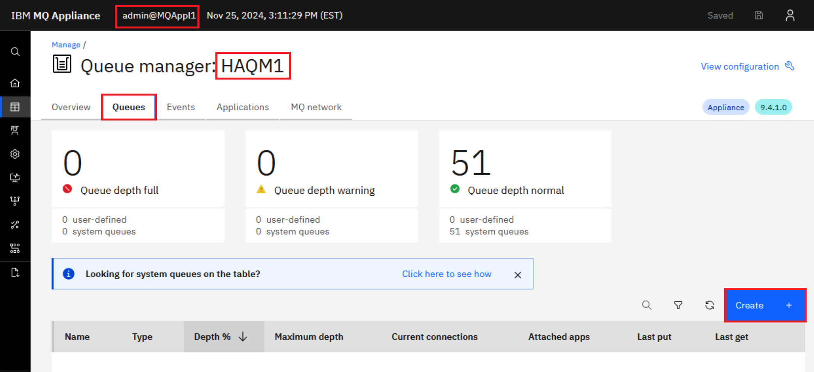
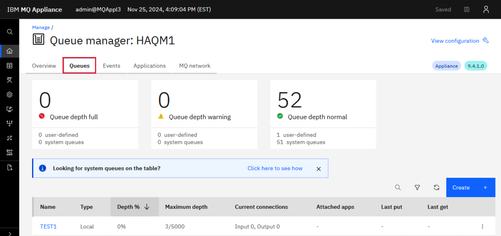

# Lab 4 - IBM MQ Appliance High Availability and Disaster Recovery (HADR)

VMs required:

* **Windows**
* **MQAppl1**
* **MQAppl2**
* **MQAppl3** 

The lab environment consists of three virtual appliances, **MQAppl1**, **MQAppl2**, and **MQAppl3**, and the Windows image, **Windows**, to perform console operations and testing. There are other virtual appliances will not be used in this lab. 

## Configuring disaster recovery for a high availability queue manger

You can specify that a high availability queue manager also belongs to a
disaster recovery configuration.

The following exercise provides insight into DR support for High
Availability Queue Managers and allows us to explore recovery of Queue
Managers running on designated HA appliances (e.g. at one site), to a
remote Disaster Recovery site (until such point as the main site is
recovered).

Both appliances in a high availability pair are typically located in the
same data center. If some disaster befalls the data center, and both
appliances are unavailable, you can manually start the queue manager on
a recovery appliance located in another data center. In this
environment, assume MQAppl3 is in another data center and will be the
disaster recovery appliance.


The MQ Appliance DR feature supports flexible DR topologies consisting
of 'live' appliances at multiple sites. DR support is provided at the
Queue Manager (QM) level, so they can be configured independently
according to DR policy -- e.g. using a simple main/recovery site DR
strategy or multi-site main/recovery strategy.

Just one network connection is required for DR between the MQ Appliances
hosting the Queue Managers. The appliances are designed to tolerate a
level of network latency between distant sites -- different than High
Availability MQ appliances, which tend to be in close proximity, and are
designed for automatic takeover with no data loss.

In a simple scenario, if a 'main' site fails, the recovery process
begins to ensure business continuity. The secondary DR Queue
Managers on the remote site are converted to Primary QMs and thus become
Primary instances on the recovery appliance or appliances, as policy
dictates. The queue managers on the main site can be either standalone or
highly available. The previous lab focused on the recovery of the standalone
queue manager, while this lab will setup recovery of a highly available queue manager. 

It may be worth noting that 'ports' or 'interfaces' mentioned
in this lab (e.g. eth0, eth4) are mapped different to those on the
physical MQ appliance, that may be rack-mounted in the real world.

The tables below outline the network configuration for each appliance. It is essential to review and understand this setup, as it will be referenced throughout the lab. Pay particular attention to **eth4** as it is the adapter used for DR on the virtual appliance. 

### MQAppl1 Addresses

|Virtual Adapter Network Name | Appliance Ethernet Interface | Usage | DHCP | IP Address | Gateway Addresses |
|:---------------------------:|:----------------------------:|:-----:|:----:|:----------:|:-----------------:|
| Network 1 | eth0 | Management and client traffic | No | 10.0.0.11 | 10.0.0.1 |
| HA1 | eth1 | HA primary connection | No | 10.0.1.11 | 10.0.1.1 |
| HA2 | eth2 | HA alternate connection | No | 10.0.2.11 | 10.0.2.1 |
| HArep | eth3 | HA replication connection | No | 10.0.3.11 | 10.0.3.1 |
| DRrep | eth4 | DR replication connection | No| 10.0.4.11 | 10.0.4.1 |


### MQAppl2 Addresses


|Virtual Adapter Network Name | Appliance Ethernet Interface | Usage | DHCP | IP Address | Gateway Addresses |
|:---------------------------:|:----------------------------:|:-----:|:----:|:----------:|:-----------------:|
| Network 1 | eth0 | Management and client traffic | No | 10.0.0.12 | 10.0.0.1 |
| HA1 | eth1 | HA primary connection | No | 10.0.1.12 | 10.0.1.1 |
| HA2 | eth2 | HA alternate connection | No | 10.0.2.12 | 10.0.2.1 |
| HArep | eth3 | HA replication connection | No | 10.0.3.12 | 10.0.3.1 |
| DRrep | eth4 | DR replication connection | No| 10.0.4.12 | 10.0.4.1 |


### MQAppl3 Addresses


|Virtual Adapter Network Name | Appliance Ethernet Interface | Usage | DHCP | IP Address | Gateway Addresses |
|:---------------------------:|:----------------------------:|:-----:|:----:|:----------:|:-----------------:|
| Network 1 | eth0 | Management and client traffic | No | 10.0.0.13 | 10.0.0.1 |
| HA1 | eth1 | HA primary connection | No | 10.0.1.13 | 10.0.1.1 |
| HA2 | eth2 | HA alternate connection | No | 10.0.2.13 | 10.0.2.1 |
| HArep | eth3 | HA replication connection | No | 10.0.3.13 | 10.0.3.1 |
| DRrep | eth4 | DR replication connection | No| 10.0.4.13 | 10.0.4.1 |


### Prepare for HA group in DR configuration

1. Return to **MQAppl1**'s MQ Console, add a local queue named
    "**TEST1**" on queue manager **HAQM1**.

   

   

   

2. Open the properties for **TEST1** by clicking the elipsis and select *View configuration*. 

    

3. Click *Edit* and change the **TEST1** queue default persistence to be  **persistent**. 

    Click **Save** to save the change.

      
    
     

4. Click *Actions* in the top left, and select *Create Message*.

    

5. Input any message in the *Application data* section and click *Create*.

    

6. Repeat this twice more so you have 3 messages in the queue.

7. Return back to the list of queues, click the hyperlink for **TEST1** to make sure the messages were added.

    

   You are now ready to test DR.

### Configure DR for HA queue manager

1. On the **MQAppl1** MQ Console, navigate to *Manage* > *Queue managers*. Click the elipsis for **HAQM1** then click **Stop** to end the queue manager **HAQM1**.

    
    
    You will receive the green success pop-up.

### Create a DR primary and backup QM on recovery device

The next task is to create a DR primary (MQAppl1) queue manager and a
backup queue manager on the recovery site (MQAppl3). Note that the HA
appliance pair MQAppl1 and MQAppl2 need to be running also.

1. Make sure that the HA queue managers are not in split-brain status.

    Using a PuTTY window for **MQAppl1**'s command line, enter the command:

	```
       status HAQM1
    ```

    

    The HA status shows **Normal**. If this wasn't the case then you should review the [How to resolve partitioning](#partitioning_resolved) section at the end of the lab.

6. On the **MQAppl1** browser session in *Manage* > *Queue managers*, click *Disaster recovery*. Click the elipsis for **HAQM1** (stopped) and select *Configure DR*. 

    

7. Click **Setup DR Primary**.

   

8. Specify that the **HAQM1** queue manager is the primary instance in a
    disaster recovery configuration.

    Complete the dialog (below) with the IP address of eth4 from the DR
    site (MQAppl3) in the information as follows:

    **Standby appliance name: MQAppl3**
    
    **Standby appliance IP address: 10.0.4.13** (or appropriate eth4
    address of MQAppl3)

    **Disaster recovery port: 2023**

    

    Check the **I understand that to setup disaster recovery my queue manager will be stopped and automatically restarted**.

    Click **Save**. 
    
    
    
     If entering the command manually on the appliance CLI it would look like this:

	```
       crtdrprimary -m HAQM1 -r MQAppl3 -i 10.0.4.13 -p 2023 -t -a 
    ```
   
   The parameters are as follows  
    -   *-m*  queue manager name
    -	*-r*	name of the recovery appliance
	-   *-i*  ip address of DR replication interface on the recovery appliance
	-   *-p*  data replication listener port 	
	-   *-t*  replication type:
	    -	*a*		asynchronous
   
   The DR creation task can take a bit of time, wait at least a minute or two.
      
   This generates the *crtdrsecondary* command which you need to run on MQAppl3. Copy the command in the pop-up window so that you can submit it on MQAppl3.
   
    

1. Logon to the **MQAppl3** MQ Console via the browser. Navigate to *Manage* > *Queue managers*, then click *Disaster recovery*. Click *Create DR secondary queue manager* button.

	 
	
1.	Paste the command you copied from MQAppl1 into the field where it says to "Enter command to setup secondary". Notice the fields below are populated when you paste the command. You could also click the hyperlink and enter the fields manually if you didn't copy from MQAppl1. But it is much easier to copy from MQAppl1 and paste on MQAppl3. 
	
	Click *Connect*.  
	
	
	
	The command configures the queue manager, and reserves storage for the data snapshot on both appliances. The command would look like this if entered manually on the appliance CLI:

	```
       crtdrsecondary -m HAQM1 -s 2048 -l MQAppl1,MQAppl2 -i 10.0.4.11,10.0.4.12 -p 2023 -t -a -v 10.0.4.13
    ```

13. Wait for the command to complete (a few seconds) and you will see
    that **HAQM1** is added to the *Local Queue Managers*. Note that its *DR status* is *Secondary*.
    
    

14. Return to the **MQAppl1** browser, click on the *Manage* breadcrumb.

	

1.  Select the *Disaster Recovery* tab and you will now see that **HAQM1** has a *DR status* of *Normal* and *DR role* of *Primary*.
    
     
    
    If the DR status for HAQM1 shows *Normal* 'Synchronization in progress', wait a few seconds for it to complete.

16. Click the elipsis for **HAQM1** and select *Configure DR* to display the DR details. 

	

	The display will reflect what you entered on the DR Create Primary command. It shows that the status is *Normal* and there is 0 data out-of-sync.

    
    
17. Repeat the DR Status command on **MQAppl3**'s MQ Console. Click the elipsis for **HAQM1** and select *Configure DR*. 

	 
	
	The status shows *Normal* on MQAppl3 also. 
	
	

### Test DR for HA group

You can simulate a disaster at the primary data center by shutting down
the MQAppl1 and MQAppl2 virtual appliances.

1. On the **environment** dashboard, shut down **MQAppl1** first, then
    shutdown **MQAppl2**. You only need to wait between shutdowns as
    long as it takes the environment dashboard to return control. 

    

2. When **MQAppl2** has been shut down, return to the **MQAppl1** MQ Console. Refresh the page and see the "*Lost communication with the server*", "*Problem loading page*", or "*The connection has timed out*" message.

    
    
3. Now you can return to the **MQAppl3** MQ Console. In *Manage* > *Queue managers*, click *Disaster recovery*. Click the elipsis for **HAQM1** and select *Make primary*.

	 
	
	You could also select *Configure DR*, which takes you the status page where you can click the hyperlink for *Make Primary*. 

4. You will receive the green successful operation message. HAQM1 is
    now primary on MQAppl3 and can be started. Before you start the
    queue manager, check the DR status once more to see that it in fact
    shows DR primary. The status display shows that the remote appliance is no longer
    available and the recovery appliance is now the primary.
    
    

5. Now start the queue manager **HAQM1** on the recovery appliance
    **MQAppl3**.

    
    
1. Click the elipsis for **HAQM1** and select *Configure DR*. This will display the overall disaster recovery status for the queue manager.  
    
     
    
    HAQM1 is now running and is now the DR Primary.

     

6. Click *HAQM1* in the breadcrumbs. 

    
    
    This will take you to the MQ Console for *HAQM1* while it is now running on *MQAppl3*. Navigate to the *Queues* tab.

    
    
7. Oh look! There are three messages on the **TEST1** queue. This is
    expected since you gave TEST1 default persistence.

    

8. Browse those message by clicking the hyperlink for *TEST1*. As you would expect they are the messages you put on the queue while HAQM1 was running on MQAppl1. 

    
    
	HAQM1 has successfully failed over to the disaster recovery site and all
messages are available for processing. Client applications will need to
reconnect to 10.0.0.13, and they would connect automatically if the CCDT
has both addresses coded.

Congratulations, you have completed Lab 4 High Availability and Disaster Recovery. 


<a name="resolve_partitioning"></a>
## How to resolve partitioning

### Resolving a partitioned problem in a high availability configuration

A high availability (HA) partitioned problem occurs when the two appliances in a high availability configuration lose the ability to communicate with each other. If both the primary and secondary connections are lost, the queue manager will run on both appliances at the same time.

If the two appliances in your high availability configuration lose both primary and secondary interface connections, then replication no longer occurs between the two appliances. After the connection is restored, the data replication system detects that there have been independent changes to the same resources on both appliances. This situation is described as a HA partitioned situation, because the two appliances have two different views of the current state of the queue manager (it is sometimes called a 'split-brain' situation). When the first connection is restored (either primary or secondary), the queue manager is stopped on one appliance but continues to run on the other. The HA status is shown as HA partitioned.

### Choosing the 'winner'

To resolve the situation, you must decide which of the two appliances has the data that you want to retain, you then issue a command that identifies this appliance as the “"winner"”. Data on the other appliance is discarded. The queue manager is then started on one appliance, and the data replicated to the other appliance.

To help you decide, you can run the status command for the affected queue manager on each appliance. The status command returns an HA status of partitioned together with a report of how much out-of-sync data the appliance has for that queue manager. 

You can also view the actual data associated with the affected queue manager on each appliance by interrogating the state of each queue manager. Stop all your HA queue managers and disable HA control by issuing the following command for each HA queue manager:    

```
   endmqm -w qmgr
```
	
Then follow these steps to run each affected queue manager on each appliance, outside of HA control, so that you can interrogate the state of each version of the queue manager:

1. Display the HA status to confirm that the HA control field shows disabled, and that the queue manager is ended on both appliances:

    ```
    status qmgr
    ```
    
    See Viewing the status of a high availability queue manager. (If the queue manager is running on the other appliance, end it there too.) You can use the HA last in sync field in the status reports to help determine when the queue manager data diverged and the seriousness of the partitioning.

1. On the appliance that is the primary for the queue manager, restart the queue manager outside of HA control:

	```
	strmqm -ns qmgr
	``` 
	
	This command starts the queue manager without starting the listener, to prevent any applications connecting. (If you need a listener in order to connect to the queue manager from, for example, IBM MQ Explorer, then you should start a listener manually by using a RUNMQSC command. Start the listener on a different port to the normal one so that applications cannot connect.)

1. Display the HA status again and verify that the queue manager is running and that HA control still shows disabled:

	```
	status qmgr
	```

1. Interrogate the state of the queue manager, for example, by browsing messages.

1. End the queue manager once more:

	```
	endmqm -w qmgr
	```

1. Display the HA status again and verify that the queue manager is ended on both appliances:

	```
	status qmgr
	```

1. Suspend the HA group on this appliance by entering the following command:

	```
	sethagrp -s
	```

1. Display the HA status of this appliance to confirm that it is in the standby state:

	```
	dsphagrp
	```

1. Log in to the other appliance and start the queue manager:

	```
	strmqm -ns qmgr
	```
	
	(This command starts the queue manager without the listener. If you need a listener, see the advice in step 2.)

1. Check the status and confirm that the queue manager is running and that HA control is still disabled:

	```
	status qmgr
	```

1. Interrogate the state of the queue manager on that appliance, for example, by browsing messages.

1. End the queue manager:

	```
	endmqm -w qmgr
	```

1. Display the HA status and confirm that HA control is still disabled and that the queue manager is ended on both appliances.

1. Resume the suspended appliance:

	```
	sethagrp -r
	```

1. Display the HA status and confirm the suspended appliance is now active, and HA control is still disabled, and HA status is Partitioned on both appliances.

	```
	dsphagrp
	status qmgr
	```

### Implementing your choice of winning appliance

> <span style="color: Blue">**Note:** <BR>It is a good idea to take back ups of both sets of data before you implement your choice of 'winner', see Backing up a queue manager.</span>

You identify the winner by running the following commands on the chosen appliance:

1. Make the queue manager on the winning appliance the primary:

	```
	makehaprimary HAQMName
	```

1. Where HAQMName is the name of the queue manager. The data is then synchronized between the queue managers on the winning appliance and the other appliance.
Check the HA status to confirm that synchronization has finished and a status of Normal is reported on both appliances:

	```
	status qmgr
	```

1. Start the queue manager with HA control:

	```
	strmqm qmgr
	```

1. Whichever appliance that you start the queue manager on, it should run on the appliance that has been designated as its preferred appliance.
Display the HA status on both appliances and confirm HA control is enabled and the queue manager is active on only the preferred appliance:

	```
	status qmgr
	```

### Other situations

If the two appliances lose the replication interface, the HA status is reported as Remote appliance(s) unavailable. The running queue manager might accumulate out-of-sync data. The other queue manager remains in standby with no out-of-sync data. When the connection is remade, replication is resumed.

If your HA queue manager is configured for disaster recovery, and failed over to the recovery appliance when your HA group went out of service, then you might have to resolve data partitioning between the HA group and the recovery appliance. After you have restored your HA group, and resolved data partitioning between the primary and secondary appliances, you must follow the procedure described in Switching back to the main appliance.
