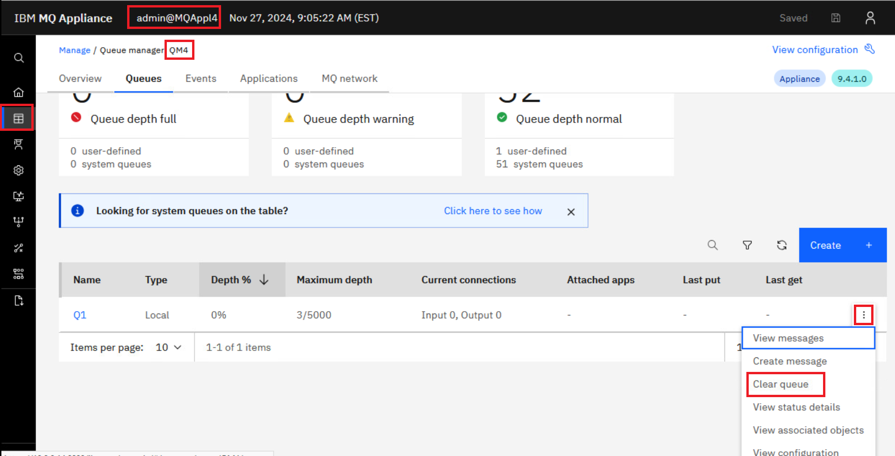
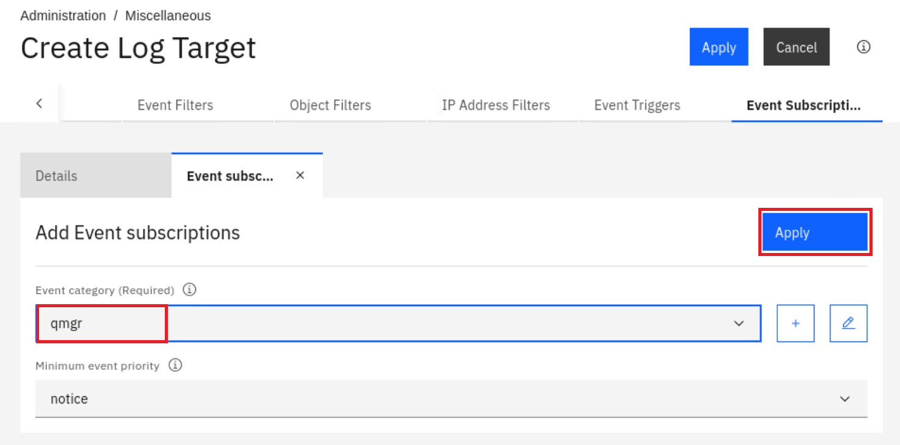

# Lab 5 - Monitoring and Troubleshooting

## Monitoring and troubleshooting

VMs required:

* **Windows**
* **MQAppl4**
* **Workstation**

### Monitoring and reporting

For this lab, you will use one virtual appliance, MQAppl4, and the Windows and RHEL Workstation environment to perform console operations. There are other virtual appliances will not be used in this lab. 

You will be exploring some of the options available for monitoring the
MQ Appliance using a combination of command line and reporting in the MQ Console. You will also look at how you can observe usage of the MQ Appliance. Finally, you
will configure log forwarding using syslog.

### Monitoring system resource usage

1.  On the Windows machine open a *MQAppl4* PuTTY window, if you don't already have one. The login details are (**admin** / **Passw0rd!**) if needed.

	Before you investigate the MQ-specific resource monitoring, you will
start by monitoring the operation of the appliance itself. You can use
the *show* command to monitor different aspects of the appliance.

	You can use the show command to view information about how an aspect of
the appliance is configured or to monitor aspects of the appliance
operation. The status_provider argument specifies which information you
view. The show command is available at login, and in most configuration
modes.

	There is a large list of *status_provider* values available for the *show* command. The complete list can be found in the [IBM Documentation](https://www.ibm.com/docs/en/mq-appliance/9.4?topic=usage-monitoring-appliance-by-using-show-command) for the MQ Appliance.

	You will investigate a few of these.

2. If you are at the *mqcli* command prompt, exit from it.

	

3. First, enter the *show* command. This will give a list of all of
    the available *status_provider* values.

	
    
4. Now enter *show version*. This will show the firmware and library version, similar to what is shown below.

	

	One of the other things that you can find out from the show command is
which users have been defined for the appliance.

5. Enter **show usernames**

6. You should see two users: the admin user, which was pre-configured,
    and the user set up to reset passwords.

	

7. You can also use the show command to give a list of logged-on users.
    Enter **show users**.

	You can see below that the admin user is logged on via the serial
    port, another via secure shell from the windows machine (which is 
    you entering commands in to the console) and also a
    login via the MQ Console (if you are not logged on, log on to the
    MQ Console [web admin] and rerun the command).

	

8. Next, get monitoring information about the MQ environment on the
    appliance.

    Go to the MQ command line interface.

	```
       mqcli
    ```
	You will now use the status command to view information about resource allocation.
    
    You can use the status command to view the following information about the system resources on the appliance:     
    * the size and usage of the system memory of the system  
    * the CPU usage of the system, the size and usage of the internal disk     
    * the size and usage of the system volume     
    * the number of FDCs and the disk space used    
    * the disk space used by trace 


10. Enter the command: **status**

	You will see a response similar to the following:

	
	
	 More about the status command: 

    You can also use the status command to view the following information about the system resources that are used by a queue manager:     
    * the queue manager name     
    * the queue manager status     
    * an estimate of the CPU usage of the queue manager     
    * an estimate of the memory usage of the queue manager    
    * the amount of the queue manager file system used by the queue manager    
    
    For a high availability queue manager, additional information can be viewed:     
    * the file system size for the queue manager     
    * the replication status of the queue managers     
    * the preferred appliance for the queue manager     
    * whether a partitioned situation has been detected    
    * if detected, the amount of 'out-of-sync' data held 

11. Let's create a new queue manager for us to explore. Run the following to create and start a new queue manager:    
    ```
       crtmqm -p 1714 QM4
       strmqm QM4
    ```

	


11. Enter the status command for QM4:

	```
       status QM4
    ```

12. You should see a response similar to the following:

	
	
	You can use the amqsrua command to query metadata that is related to the
system resource usage of a queue manager.

	About amqsrua: 
    
    The **amqsrua** command reports metadata that is published by queue managers. This data can include information about the CPU, memory, and disk usage. You can also see data equivalent to the STATMQI PCF statistics data. The data is published every 10 seconds and is reported while the command runs. 
    
    
    * **-n MaxPubs** -- Specifies how many reports are returned before the command ends. The command publishes data every ten seconds, so if you enter a value of 50, the command returns 50 reports over 500 seconds.
	
    
    If you do not specify this parameter, the command runs until either an error occurs, or the queue manager shuts down.
	   
    
    * **-m QMgrName** -- Specifies the name of the queue manager that you want to query. The queue manager must be running. If you do not specify a queue manager name, the default queue manager is used.   


13. You are going to report the metadata for 5 minutes, while putting
    some messages onto a queue and see the results. As this is a new Queue Manager we will first create a queue. 

7.  Open the MQ Console for MQAppl4 and login using **Admin**/**Passw0rd!**.

	

8.  Navigate to **Manage** > **Queue Managers** and click on the hyperlink for **QM4**. 

	
    
9.  You are taken to the *Overview* tab for the queue manager. Select the **Queues** tab and create a new queue by clicking on **Create**. 

	

13. Click the **Local** tile and **Next**. Name the queue **Q1** and leave the default object type set to local. Click **Create**.

    

    

14. You are returned to the list of queues and **Q1** is now in the list.

    


14. Enter the command as follows:

	```
       amqsrua -n 30 -m QM4
    ```

	with the following responses:

	**STATMQI** for the Class selection and **PUT** for the Type selection.

	
	
15. Go to the MQ Console and put some messages on the **Q1** queue.

16. Depending on how many messages you put on
    the queue, you will see results similar to the following:

	
	
17. Enter **CTRL-C** to end the amqsrua command.

18. Now you will move on to the MQ Console and see some of the reports
    that you can generate.


19. Return to the **MQ Console > Manage > QM1**. Click the elipsis on far right for the **Q1** queue and select **Clear queue**. 

	

20. Click **Clear queue** to confirm deletion of the messages.

	


### Troubleshooting

In this section of the lab you will review the logs that are
available for troubleshooting. The MQ Appliance has a set of logs
similar to traditional MQ. In this section, you will understand where
they are stored on the MQ Appliance and how to access them.

First, look at where the MQ error logs are stored.

1. On the *MQAppl4* appliance command line, exit from any command if
    necessary and then exit from mqcli. This will take you back to the
    **mqa\#** prompt.

2. Enter the **config** command to take you into configuration mode.

	```
       config
    ```

	

	Directory structures on the appliance are accessible in the form of
    URIs. There is a dedicated URI, *mqerr*, for accessing IBM MQ logs.

3. Enter the following command (make sure you put the colon at the
    end).

	```
       dir mqerr:
    ```

4. You will see the structure of the log directories.

	

5. Enter the following command to see the QM1 queue manager logs. These
    will be familiar to anyone familiar with MQ:

	```
       dir mqerr:qmgrs/QM4
    ```

	
	
6. Enter **exit** to exit configuration mode.

7. Go to the MQ command line interface -- enter **mqcli**.

	You can list or view the system error logs, queue manager error logs,
and first failure data captures (FDCs) by using the dspmqerr command.

8. Enter:

	```
       help dspmqerr
    ```

9. This will list the options available for viewing the logs.

	
	
	About **dspmqerr:** 
    
    
    The command is based on the UNIX *less* command. The less command provides controls for navigating the contents of a file, and you can use these controls when you view system error logs.: 
    
    
    Try the following tips:     
    * Use the arrow keys to scroll up and down the logs     
    * Use the page, space, or return keys for simple scrolling     
    * Enter *q* to exit at any time    
    * Enter *h* to display full help while you view a log. The help lists further commands, for example, for searching for strings or jumping a set number of lines. 
    
	
10. Look at the AMQERR01.LOG for QM1. Enter:

	```
       dspmqerr -m QM4 AMQERR01.LOG
    ```

	
    
1.  Review the log entries. Hold the space bar down to scroll to the end. When you ran the test you received an error for filling the *MONITOR* queue. You should see FDCs created at the end of the log. Notice that they were due to the write command.

	
	
11. When done reviewing the log, enter **q**.

12. Enter this command to see the system log.

	```
       dspmqerr -s
    ```

	

13. When done reviewing the log, enter **q**.

14. It is possible to copy the error logs from the MQ Appliance. This is
    done from the configuration mode (the config prompt) using the
    **copy** command or from the MQ Console (using the File Management
    option). 

    Lets see this in action now. Exit out of the *mqcli* returning to the *config* prompt.

	

15. We will copy the MQERR01.LOG file to the RHEL workstation. This is already configured to receive SCP communication. Run the following command:
    ```
      copy mqerr:qmgrs/QM4/AMQERR01.LOG scp://admin@10.0.0.30/AMQERR01.LOG
    ```
    You will be prompted for a password. It is **IBMDem0s**.
 
	


1.  In the *Environment tab* click on the workstation tile. This will open a new tab for the machine. 

    

2. In the new tab, click the clock for the password box to appear, enter **IBMDem0s** and press enter.
	   

3. Open a terminal window by clicking on **Activities** in the top left and selecting the terminal at the bottom of the screen. 
	  

4. In the terminal lets view the MQ error log. Run the following command: 
    ```
      cat ~/AMQERR01.LOG
    ```
     
	


### Configuration of log forwarding
In this part of the lab, we will explore how to forward logs from the MQ Appliance to a central location, a feature often requested by customers. Many organizations utilize a central syslog server to collect and manage logs from various systems. Centralized logging simplifies the process of reviewing logs, monitoring system health, and generating alerts for critical events.

In this part of the lab, you will configure log forwarding on the MQ Appliance, directing its logs to a RHEL workstation that is hosting a syslog server. This setup demonstrates how to integrate the MQ Appliance into an existing centralized logging infrastructure, enhancing operational oversight and proactive management capabilities.

1. In the RHEL workstation open Firefox by clicking on **Activities** in the top left and selecting the Firefox icon at the bottom of the screen. 

	 

2. Navigate to **https://10.0.0.14:9090**, accepting any certificates required.

	 

3. Enter **admin** / **Passw0rd!** as the username and password, and click **Log in**. 

	 

4. Select **Administration** > **Miscellaneous** > **Log Target**.

	 

5. Click **Add**

	 

6. Enter **LogForwardingToRHEL** for the name of the log forwarding configuration. 

	 

7. Scroll down to the **Target type** option and select **syslog-tcp**.

	 

8. For the source and destination conifguration fill in the following details:
     * Source configuration
         * Local address: 10.0.0.14
         * Local identifier: MQAppl4
     * Destination configuration
         * Remote address: 10.0.0.30
         * Remote port: 514

	 
   
9. Scroll to the top of the page and change to the **Event Subscription** tab. Click **Add**.

	

10. Select **qmgr** for the *Event category* and click **Apply**.  

	

    

11. Click **Apply** at the top of the screen. 

	

11. Click on the save icon at the top right to persist the changes. You should see that the status is **[up]**. This is showing that the log forwarding is working.

	

12. Lets stop and start the queue manager so there is something to forward. Navigate to **manage** > **Queue Managers**, click the elipsis associated with QM1, and select **Stop**.

	

13. Again click the elipsis associated with QM1, and select **Start**.

	

3. Open a terminal window by clicking on **Activities** in the top left and selecting the terminal at the bottom of the screen. 
	  

4. The directory where the log messages are stored is only available to root. In a real world setup this wouldn't be the case. To show the log run the following command: 
    ```
      sudo cat /var/log/MQAppl4/messages.log
    ```
     
	

5. You will observe two lines of output, representing log messages generated at the configured level for the queue manager (qmgr) object. In a real-world scenario, this approach can be adapted to configure different objects and specify varying log forwarding levels as required.

    


## Congratulations
This concludes the Monitoring and troubleshooting lab.

