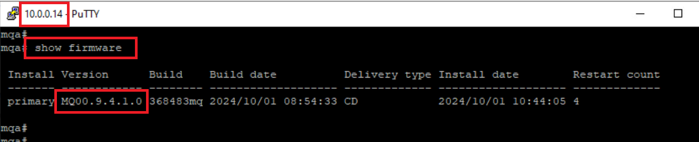
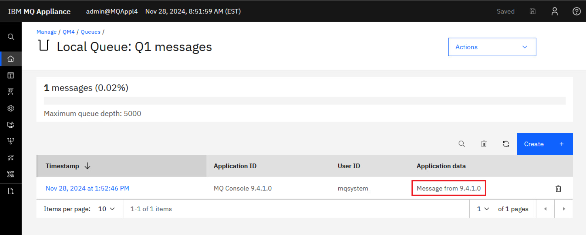

# Lab 6 - Service and Maintenance

In this lab, you will explore how to maintain the appliance. You will
learn how to back up and restore the configuration, backup and restore
an individual queue manager, and how to execute service procedures such
as upgrading the appliance firmware.

## The virtual environment

VMs required:

* **Windows**
* **Workstation**
* **MQAppl4**

The lab environment consists of one virtual appliance **MQAppl4**, the Windows image, **Windows**, to perform console operations and testing, and the RHEL image, **Workstation** as a store for backing up data. There are other virtual appliances that will not be used in this lab. 

The MQAppl4 appliance is currently running version 9.4.1.0 of the
firmware. In this lab, you will upgrade the firmware to V9.4.1.1, before
reverting to V9.4.1.0 again.

## Back up the IBM MQ Appliance configuration

You can back up various features of your IBM MQ Appliance and restore
these features to the same or to a different appliance, if required.

After you back up an appliance, you must restore it to the same or
another appliance that is running the same firmware level.

As of 9.3.5, there is a new secure backup and restore facility which simplifies and streamlines the process of backing up the appliance configuration and messaging users and groups. This simplifies the overall process.

To back up your IBM MQ Appliance, you complete the following actions:
- Run a secure backup to back up the following objects:
  - The configuration of the appliance.
  - Messaging users and groups.    
- Back up queue manager configurations and data.

These backups are created on the appliance and you use URIs to copy the backed-up information from the appliance to safe storage. You also use URIs to restore backed-up information to a target appliance. You restore an appliance in the following order:

- Restore a secure backup to restore the following objects:
   - The configuration of the appliance.
   - Messaging users and groups.
- Restore queue manager configurations and data

In this lab, you will first back up the IBM MQ Appliance configuration and 
queue mananger in preparation to upgrade the firmware. After upgrading the firmware to 9.4.1.1, you will then make a change to the queue manager. You will then roll-back the firmware 
to 9.4.1.0 and restore the MQ Appliance configuration and queue manager from
the backups.

### Performing the secure backup of the appliance configuration


In this section of the lab, we will perform a secure backup of the MQ Appliance configuration. It is important to note that this backup does not include the MQ Queue Manager configuration or its associated data, as these will be backed up separately.

The secure backup feature, introduced in version 9.3.5, streamlines the backup process. Previously, separate backup sets were required to cover various components of the MQ Appliance configuration.

With this enhanced functionality, we will configure a certificate to secure the backup data and execute a single command to generate the backup. Finally, we will transfer the backup file to an external location to ensure its availability for restoration when needed.

1.  Open a new PuTTY window to access the command line interface of your IBM MQ Appliance --
    **MQAppl4**.

2.  If not logged in, use the user name **admin** and password
    **Passw0rd!** to log in to the administrators group.

3.  Display the current firmware details with the command (ensure you
    are at the high-level prompt):

	```
       show firmware
    ```
	
	

	The installed firmware is at the 9.4.1.0 level. You will upgrade the
    firmware to v9.4.1.1.

4.  Type the following command to enter configuration mode:

	```
       config
    ```

5.  Type the following command to write the current configuration to the
    backup file autoconfig.cfg:

	```
       write memory
    ```

6.  When prompted, reply **y** that you want to overwrite the current
    autoconfig.cfg file. 
    
    Overwrite existing autoconfig.cfg? **y**. 
    
    

7.  We will create a new certificate to secure the backup. In your own environment you may create the certificate outside of the MQ Appliance environment and import. For this lab we will show how this can be created on the MQ Appliance. Enter the *crypto* configuration mode by type:
    ```
       crypto
    ```

8. Then generate a new certificate using the following command:
    ```
       keygen CN "MQApplSecureBackup" gen-sscert file-name ss_mqappl_securebackup export-key export-sscert
    ```

    
    
    The keygen command specifies additional options to copy the generated certificate and private key files to the temporary: directory so we can subsequently download them to a location where you can use them for a secure restore. In the real world you should delete the certificate files from temporary: after you have downloaded them.

11. The certificate has been created as a file, but the MQ Appliance doesn't know it as a certificate object. To register as a certificate object running the following command.
    ```
      certificate ss_mqappl_securebackup cert:///ss_mqappl_securebackup-sscert.pem      
    ```

    

9. Use the copy command to move private key to the RHEL box. Use **IBMDem0s** as the password when prompted.
   ```
      exit
      copy temporary:///ss_mqappl_securebackup-privkey.pem scp://admin@10.0.0.30/ss_mqappl_securebackup-privkey.pem
    ```

    

9. Use the copy command to move public certificate to the RHEL box. Use **IBMDem0s** as the password when prompted.
    ```
      copy temporary:///ss_mqappl_securebackup-sscert.pem scp://admin@10.0.0.30/ss_mqappl_securebackup-sscert.pem
    ```

    

10. Lets remove the certificate and key from the temporary directory.
    ```
      delete temporary:///ss_mqappl_securebackup-sscert.pem 
      delete temporary:///ss_mqappl_securebackup-privkey.pem
    ```

    


12. We are now ready to create the secure backup for the MQ Appliance.
    ```
      secure-backup ss_mqappl_securebackup temporary:///myBackupDir/      
    ```

    


9. Use the copy command to move the secure backup to the RHEL box. Use **IBMDem0s** as the password when prompted.
    ```
      copy temporary:///myBackupDir/backupmanifest.xml scp://admin@10.0.0.30/backupmanifest.xml
      copy temporary:///myBackupDir/cert.tgz scp://admin@10.0.0.30/cert.tgz
      copy temporary:///myBackupDir/config.tgz scp://admin@10.0.0.30/config.tgz
      copy temporary:///myBackupDir/mq-users.tgz scp://admin@10.0.0.30/mq-users.tgz
      copy temporary:///myBackupDir/password-map.tgz scp://admin@10.0.0.30/password-map.tgz
      copy temporary:///myBackupDir/root.tgz scp://admin@10.0.0.30/root.tgz
    ```

        


## Queue manager backup 

IBM MQ includes commands to provide an easy way to back up and restore a
queue manger. You connect to the MQ Appliance by using the command line
to use the mqbackup command, and save the queue manager to a file. The
queue manager configuration is saved, together with log files and queue
data.

Before you do the first backup of a queue manager on an appliance, you
must create the target directory for backup files, and allocate storage
for it in the appliance RAID volume.

> <span style="color: Blue">**Note:** <BR>A backup of a high availability (HA) queue manager does not contain any HA configuration data, so if you restore the queue manager from a backup file, it is restored as a stand-alone queue manager. Similarly, disaster recovery (DR) configuration data is not preserved when you back up a DR queue manager. You can redo this configuration after restore. Also, the auto-config and auto-cluster information for a queue manager that is part of a uniform cluster is not backed up automatically. You should back up all files ending in .ini or .mqsc in the mqbackup directory</span>


You can back up any type of queue manager while it is running, but this requires sufficient unallocated space on the internal disk to contain a temporary snapshot of the queue manager. This space is not required for a stand-alone queue manager if it is stopped before the backup is taken. HA and DR queue managers are always backed up from an internal snapshot, however, and so always require unallocated space on disk regardless of whether they are running or not.

If you are backing up so that you can use an archive file to migrate the queue manager, or if you want to be able to restore a queue manager to the state it was in at a particular time, then you should stop the queue manager before you back it up.

If the queue manager is running when you run the mqbackup command, a warning message is displayed.

If a queue manager is stopped before you take a backup, it is locked during the backup and cannot be started, deleted or otherwise changed while the backup runs.

### Performing a queue manager backup
In the previous lab we created *QM4* on *MQAppl4*. We will backup and restore this queue manager. This queue manager has a single queue called *Q1* with no data include. We will change the persistent message setting on the queue and put a message prior to backing up.

1.  Open the MQ Console for MQAppl4 and login using **Admin**/**Passw0rd!**.

	

2.  Navigate to **Manage** > **Queue Managers** and click on the hyperlink for **QM4**. 

	

3. Click the elipsis associated with *Q1* and select *View configuration*.

	

6. Click *Edit* and change the **Q1** queue default persistence to be  **persistent**. 

    Click **Save** to save the change. Click on the **Queues** breadcrumb.

      
    
     

7. Click the hyperlink for **Q1**, and put a messages on **Q1**.

    

   You are now ready to take the backup.

1. Go to the PuTTY window for *MQAppl4* and enter **mqcli** to go to the MQ shell.

17. Since this is the first time you have backed up any queue manager on
    this appliance, type the following command to allocate storage for
    your backup:

	```
       createbackupfs -s 2
    ```
    
    **where "-s" is the *size* of the space that is allocated in GB** (you
    can use the "**m**" modifier to signify a size in megabytes if desired). 
    
    

1.  In the browser tab for *MQAppl4* > *Administration* > *Main* > *File management* you will see a new directory that is named **mqbackup:///QMgrs** has been created and allocated that storage.

	

18. End the queue manager by running the following command from the PuTTY window:

	```
       endmqm QM4
    ```

	

19. Enter the following command to backup the queue manager:

	```
       mqbackup -m QM4
    ```
    
    

20. A backup file named **QM4.bak** is created and stored in the **mqbackup:///QMgrs** URI.

	

    > <span style="color: Blue">**Note:** <BR>The backup can take some time to|run, during which period you cannot use the CLI. By default, the archive file is named *QM\_name*.bak, but you can add the **-o outfilename** argument to the mqbackup command to specify a file name, if required.</span>

9. Use the copy command to move the backup to the RHEL box. Use **IBMDem0s** as the password when prompted.
    ```
      exit
      copy mqbackup:///QMgrs/QM4.bak scp://admin@10.0.0.30/QM4.bak
    ```

           

## Firmware upgrade

To upgrade your IBM MQ Appliance, you install the latest level of
firmware on the appliance.

New function, security updates, and maintenance fixes for the IBM MQ
Appliance are made available through firmware releases. Additional
maintenance through iFixes are made available, as necessary, on the most
recent firmware level release.

You can also revert to a previous level of firmware to back out of an
upgrade, if required.

Fixes are cumulative, so you should always download the most recent
firmware that is available on the IBM Fix Central website.

All queue manager information persists through upgrades and rollbacks.

The standard rules of applying upgrades to IBM MQ apply when firmware is
upgraded and queue managers restarted. If the new firmware moves the IBM
MQ installation to a new command level, any queue managers that are
started at the new command level are no longer able to start under a
lower command level, even following a firmware rollback. This is why we took 
Queue Manager backup.

### Performing a firmware upgrade

You upgrade the IBM MQ Appliance by downloading a new version of the
firmware, copying it to the appropriate URI on the appliance, and
issuing the appropriate command to reboot the appliance with the new
firmware.

Normally you would use a computer with web access to download the
required image from [IBM Fix
Central](http://www-933.ibm.com/support/fixcentral/). This website is a
repository for all available and supported firmware images for IBM MQ
Appliances. The fixes are cumulative, so always choose the most recent
image.

In the lab environment, the download of Fix Pack V9.4.1.1 has already
been done for you and is stored in the directory C:\\Users\admin\\Downloads directory. 


Fix Packs are delivered via a scrypt\* file. Files with the scrypt3
extension is the Fix Pack for the physical appliance. Files with the
scrypt4 extension is the Fix Pack for the virtual appliance. Use the
file with ***scrypt4*** in this lab.


> <span style="color: Blue">**Note:** <BR>First you upgrade your DR node. This is to ensure that queue manager data does not run on an upgraded appliance, unable to fail over in the event of a disaster to an appliance that has not yet been upgraded. Then you upgrade the HA pair. You suspend one appliance so that any queue managers running there fail over to the other appliance in your HA pair. You then upgrade the firmware on the first appliance and restart it. Finally you upgrade the second HA appliance. </span>

The first step in a firmware upgrade is to back up your IBM MQ
Appliance and the Queue Managers. You have already done that in the first part of this lab.

You will again use the File Management tool to copy the firmware
    file to the MQ Appliance. The firmware .scrypt4 file needs to be
    placed in the **image:** folder (URI) on the MQ Appliance.

1. Return to the browser window and the *File Management* tool. Click the elipsis for **image:** and select **Upload Files** link. 
    
        
   
3. An upload dialog opens. Click the **Drag files here or click here to upload files.** link. 

	
	
4. Navigate to the **Downloads** directory. Select the **9.4.1.1-IBM-MQ-Appliance-U0000.scrypt4** file. 

	Click **Open**. 
	
	
    
5. The file will be displayed in the dialog as the file to upload and
    as the file name to save in **image:**. We do not need to rename the
    file. Click **Upload**.
    
	

   > <span style="color: Blue">**Note:** <BR>After clicking *Upload* and waiting a bit you may see an error pop up and the UI will disconnect. Wait a few minutes for the UI to come back you should be able to continue with the steps below. </span>
    
7. When the upload completes, the display will show a status message
    stating the upload was successful. Click **Continue**. 
    
        

8. You will notice that the File Management tool now shows a  next to the **image:** folder, signifying that the folder has some content. 

		

9. Click on **image:** and you will see the .scrypt4 file in the
    folder.
    
	

10. You are now ready to update the firmware file. This could be done at
    any time, now that you have the firmware file stored on the MQ
    Appliance.

11. Ensure that all the queue managers are stopped.
    
    Enter the followig commands:
    
    ````
    mqcli
    
    dspmq
    ````
    
	
	    
12. Enter **exit** to exit the mqcli shell.

13. Get the current firmware version of the appliance by entering one of
    the following commands:

	```
       show firmware
    ```
    
    or

	```
       show firmware-version
    ``` 
    
    or

	```
       show version
    ```

	

14. Type **config** to enter configuration mode.

15. Type **flash** to enter the correct mode for the firmware upgrade.

	

16. Restart the appliance with the new image by typing the following
    command:

    boot image accept-license *firmware\_file*

    where *firmware\_file* is the name of the file that contains the new
    firmware image. For this lab the command will be:

	```
       boot image accept-license 9.4.1.1-IBM-MQ-Appliance-U0000.scrypt4
    ``` 
    
    
  
17.  The appliance will then restart and the new firmware will be loaded. 

      Be patient. This will take a few minutes and the appliance will reboot. Re-connect PuTTY and wait for the **Login:** prompt to come back, then log in as before using the login **admin** and password **Passw0rd!**.

18. After you are logged in, verify that the firmware image is upgraded
    by entering the following command:

	```
       show firmware
    ```

    which shows the following results. You should see a version of
    9.4.1.1 and a 'build date' of 2024-12-12. 
    
    

    Or use one of the following commands, which show more information.

	```
       show version
    ```
	
	or

	```
       show firmware-version
    ``` 
	
	
	

### Add a message to the queue
1.  Open the MQ Console for MQAppl4 and login using **Admin**/**Passw0rd!**.

	

2.  Navigate to **Manage** > **Queue Managers**, turn on **QM4**, and click on the hyperlink for **QM4**. 

	

7. Click the hyperlink for **Q1**, and put a messages on **Q1**.

    

## Reverting to the previous level of firmware and restoring the queue manager

We will now simulate a situation where we decide that a roll-back of the firmware is required. As the Queue Manager was started this will require us to restore the queue manager from the backup as well. 

### Reverting to the previous level of firmware

When you upgrade the IBM MQ Appliance firmware by using the boot image
command, the appliance retains current configuration data. This feature
is used to restore the appliance to a known, stable state if required.

-   The previous firmware image and associated configuration data is the
    secondary installation.

-   The newly installed firmware image and associated configuration data
    is the primary installation.

This option is only available when the Appliance is configured with standalone queue managers. As MQAppl4 has a HA queue manager we will not be able to use this mechanism. Instead we will revert the firmware using the original image.

1. Return to the browser window and the *File Management* tool. Click the elipsis for **image:** and select **Upload Files** link. 
    
        
   
3. An upload dialog opens. Click the **Drag files here or click here to upload files.** link. 

	
	
4. Navigate to the **Downloads** directory. Select the **9.4.1.0-IBM-MQ-Appliance-U0000.scrypt4** file. 

	Click **Open**. 
	
	
    
5. The file will be displayed in the dialog as the file to upload and
    as the file name to save in **image:**. We do not need to rename the
    file. Click **Upload**.
    
	

   > <span style="color: Blue">**Note:** <BR>After clicking *Upload* and waiting a bit you may see an error pop up and the UI will crash. Wait a few minutes for the UI to come back you should be able to continue with the steps below. </span>
    
7. When the upload completes, the display will show a status message
    stating the upload was successful. Click **Continue**. 
    
        

8. You will notice that the File Management tool now shows a  next to the **image:** folder, signifying that the folder has some content. 	

9. Click on **image:** and you will see the .scrypt4 file in the
    folder.
    
	

10. You are now ready to update the firmware file. This could be done at
    any time, now that you have the firmware file stored on the MQ
    Appliance.

11. Ensure that all the queue managers are stopped.
    
    Enter the followig commands:
    
    ````
    mqcli
    
    dspmq
    ````
    
	
	    
12. Enter **exit** to exit the mqcli shell.

14. Type **config** to enter configuration mode and then type **flash** to enter the correct mode for the firmware upgrade.

	

16. Restart the appliance with the original image by typing the following
    command:

    boot image accept-license *firmware\_file*

    where *firmware\_file* is the name of the file that contains the new
    firmware image. For this lab the command will be:

	```
       boot image accept-license 9.4.1.0-IBM-MQ-Appliance-U0000.scrypt4
    ```
    Since this is a downgrade, you will also need to accept the warning by typeing **y**.

    
  
7. Wait for the appliance to reboot, and then login.

8. Enter **show version** to check the firmware level. Notice the
    return to the previous V9.4.1.0 level.
    
    

   In most cases reverting the firmware version will be adequate and there is no requirement to restore the MQ Appliance backup. Later in the lab we will revisit this and show how this can be applied. 

### Restoring a queue manager from a backup file

You use the mqrestore command to restore a queue manager, including all
its log files and data, from a previously taken backup. The command
cannot run if there is already a queue manager with the same name on the
appliance. The archive file must be located in the backupfs location,
**mqbackup:///QMgrs**.

You can only restore one queue manager at a time.

1. Reconnect the PuTTY window to *MQAppl4*. Login with **admin** / **Passw0rd!**. 

2. The existing queue manager must be stopped before it is deleted. From the **mqcli** command line, enter:
    
    ```
       mqcli
       endmqm QM4
    ```
    It is likely that you will receive an error message similar to the below. This is due to the Queue Manager already being stopped. 

    

2. Delete the queue manager using the following command:

	```
       dltmqm QM4
    ```
    
     

3. Copy the QM4 backup from the RHEL machine to the Appliance. You may see a prompt to overwrite an existing file. Type **Y** and use **IBMDem0s** for the password.
    ```
      exit
      config
      copy scp://admin@10.0.0.30/QM4.bak mqbackup:///QMgrs/QM4.bak
    ```
    
     

4. Return back to the mqcli and restore the queue manager, enter the following:

	```
       exit
       mqcli
       mqrestore -f QM4.bak
    ```
    
     
     
     The restore should complete successfully.
     
     > <span style="color: Blue">**Note:** <BR>With a real world queue manager with larger logs and queues, the restoration might take some time, during which time the CLI is not available.</span>   
     
4. Start the queue manager.

	```
       strmqm QM4
    ```
    
    

5. Return to the *MQAppl4* browser window. Navigate to *Manage* > *Queue managers* > *QM4* > *Queues*. You will see there is a single message from when the abackup was captured. The 9.4.1.1 is no longer available. 
    
    


## Applying a MQ Appliance backup 

Applying a MQ Appliance backup is unlikely to be required. As shown above
normally reverting the firmware level is adequate. If it does become required 
to restore a backup the MQ Appliance needs to be reset first. 

A factory reset restores the IBM MQ Appliance to its default state. Be
aware that a factory reset deletes all queue managers and messages that
are hosted on the appliance. The reset forcibly ends all queue managers
and detaches any applications that are connected to them. After the
update, you require direct console access to reinitialize the system.

### Performing factory reset

1. Using you existing PuTTY window assure you are in the config mode by typing:

	```
       config
    ```

8. Enter flash mode by typing:

	```
       flash
    ```

9. Check the firmware version:

	```
       show firmware-version
    ```

	

1. Return to the browser window and the *File Management* tool. Click the elipsis for **image:** and select **Upload Files** link. 
    
        
   
3. An upload dialog opens. Click the **Drag files here or click here to upload files.** link. 

	
	
4. Navigate to the **Downloads** directory. Select the **9.4.1.0-IBM-MQ-Appliance-U0000.scrypt4** file. 

	Click **Open**. 
	
	
    
5. The file will be displayed in the dialog as the file to upload and
    as the file name to save in **image:**. We do not need to rename the
    file. Click **Upload**.
    
	
    
6. When the upload completes, the display will show a status message
    stating the upload was successful. Click **Continue**. 
    
        

8. You will notice that the File Management tool now shows a  next to the **image:** folder, signifying that the folder has some content. 

		

9. Click on **image:** and you will see the .scrypt4 file in the
    folder.
    
	

19. Return to your **PuTTY** window.

21. Type the following command:

	reinitialize *firmware\_image\_file*`

	*For example:*

	```
       reinitialize 9.4.1.0-IBM-MQ-Appliance-U0000.scrypt4
    ```

22. You will be prompted to verify that you want to reinitialize the
    device as this will wipe out everything. Enter **y** to confirm.

    

    All queue managers will be stopped and deleted as will all services
    such as the Web GUI, HA clustering, and syslog.

      
    
    > <span style="color: Blue">**Note:** <BR>On the virtual appliance, the factory reset function is not a supported function; therefore, it does not complete the same as it would on a physical appliance. On the physical appliance, the factory reset will take a few minutes and then the appliance will reboot. The factory reset would then be complete. You would wait for the *Login:* prompt to reappear. 
    
    
    After reinitialization is complete, you must log in as **admin**, using the password **admin**, and follow the initial setup procedure described in Lab 1. 
    
    
    Note that after files are deleted, they cannot be recovered. If you might need any of these files after you reinitialize the appliance, ensure that you have copies of these files.
    
    
    The network configuration is removed too, so you can no longer access the appliance through the former IP address. You can connect to the appliance only through a serial cable. </span>


### Restore the IBM MQ Appliance configuration 

You can restore the configuration of an IBM MQ Appliance to the same or
to a different appliance.

If you are restoring to the same appliance, it will have the same IP
address and the same name. The first steps are the same as initially
configuring the appliance when you first installed it.

If you are restoring to a different appliance, it must be running the
**same** firmware level.

1. The first step is to copy backup files from the RHEL workstation onto the appliance. Run the following commands, use **IBMDem0s** as the password when prompted.:
    ```
      config
      mkdir temporary:///myRestoreDir
      copy scp://admin@10.0.0.30/backupmanifest.xml temporary:///myRestoreDir/backupmanifest.xml
      copy scp://admin@10.0.0.30/cert.tgz temporary:///myRestoreDir/cert.tgz
      copy scp://admin@10.0.0.30/config.tgz temporary:///myRestoreDir/config.tgz
      copy scp://admin@10.0.0.30/mq-users.tgz temporary:///myRestoreDir/mq-users.tgz
      copy scp://admin@10.0.0.30/password-map.tgz temporary:///myRestoreDir/password-map.tgz
      copy scp://admin@10.0.0.30/root.tgz temporary:///myRestoreDir/root.tgz
    ```

    

2. The certificates used to create the backup needs to be restored. Run the following commands, use **IBMDem0s** as the password when prompted.

    ```
      copy scp://admin@10.0.0.30/ss_mqappl_securebackup-privkey.pem cert:///ss_mqappl_securerestore-privkey.pem
      copy scp://admin@10.0.0.30/ss_mqappl_securebackup-sscert.pem cert:///ss_mqappl_securerestore-sscert.pem 
      crypto
      certificate ss_mqappl_securerestore cert:///ss_mqappl_securerestore-sscert.pem      
    ```

    

3. To decrypt the secure file we need to use the private key. A *key* object needs to be create for the private key. The certificate and key are then combined together into a *idcred*. Run the following command:

   ```
      key ss_mqappl_securerestore cert:///ss_mqappl_securerestore-privkey.pem
      idcred ss_mqappl_securerestore ss_mqappl_securerestore ss_mqappl_securerestore
   ```

    

9. Run the following command to restore the backup.
    ```
       exit
       secure-restore ss_mqappl_securestore temporary:///myRestoreDir
    ```

    

    > <span style="color: Blue">**Note:** <BR>When a secure backup is restored the password for the built-in admin user is reset to admin. The password for the admin user must be changed at first login (as happens after a factory reset of the appliance).

    The appliance will be automatically restarted. This has completed the restore process. You can move on to the next section and start reading, but you will
    have to wait for the reboot to complete before taking the next lab
    step.

Now you have completed the MQ Appliance restore you can repeat the same process to restore the Queue Manager backup. 

## Summary

You have seen how to do a backup of the IBM MQ Appliance, including how
to backup and restore a queue manager. You also have upgraded the MQ
Appliance firmware from V9.4.1.1 to V9.4.1.1. Understood how this can be reverted 
even if the Queue Manager has been started at this later version. You tested the factory
reset option, loaded the firmware, restored the configuration and the queue manager
from a backup.

Congratulations, you have finished Lab 10 Service and Maintenance.
